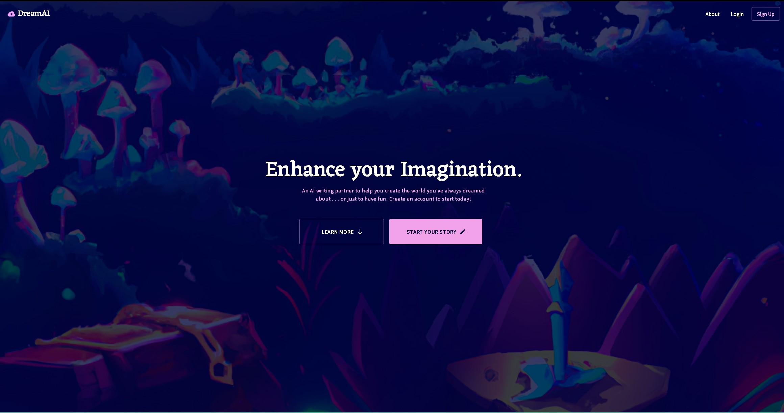
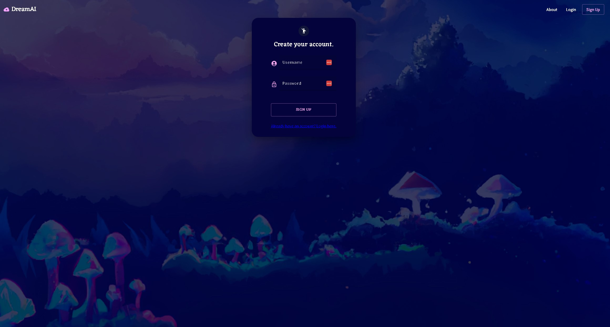
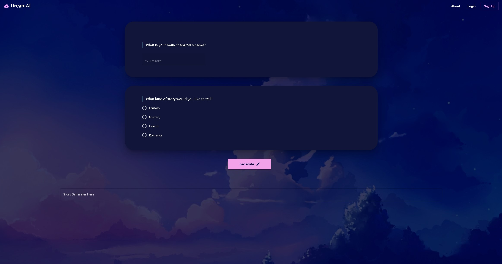

# TalesFromTheAlgorithm

The purpose of a storybook AI generator app is to provide users with a fun and creative way to generate story snippets based on their own prompts or inputs. The app would use machine learning algorithms to suggest narrative arcs or plot points based on the user's input, and then generate the corresponding story snippets in real-time. This can be a helpful tool for writers who are looking for inspiration, or for anyone who wants to engage in creative writing exercises.

## Table of Contents
- [License](#license)
- [Snapshots](#snapshots)
- [Usage](#usage)
- [Installation](#installation)
- [Technical Specifications](#technical)
- [Development Team](#team)

## License

## Snapshots
<table>
  <tr>
    <td>
      
        
      
    </td>
  </tr>
</table>

## Usage

Deployment: AWS

Site: https://awstesting.d1pvujnt4zx0rz.amplifyapp.com/

## Installation

List the steps required to install this project onto a local machine. Example:

1. Clone the repository: `git clone https://github.com/iskry/TalesfromtheAlgorithm.git`
2. Navigate into the cloned directory
3. Install dependencies: `npm install`

## Development
Front-end
- MaterializeUI
- REACT-JS
- NODE_EXPRESS-JS
- Apollo-GraphQL
- Moongoose-MongoDB
- openAi-API

## Technical Specifications
NODE version downgraded to v16.9
NODE version >= 17 does not recognize certain features required by other dependencies.

## Development Team

Jordan Barringer * [github](https://github.com/manyLizards)

Toliver Crisp * [github](https://github.com/tolivercrisp)

Mitchell Wood * [github](https://github.com/mitchell4563)

Troy Sparks * [github](https://github.com/iskry)

Emre Taskale * [github](https://github.com/EM-T-Shells)
#
#
#
#
#
